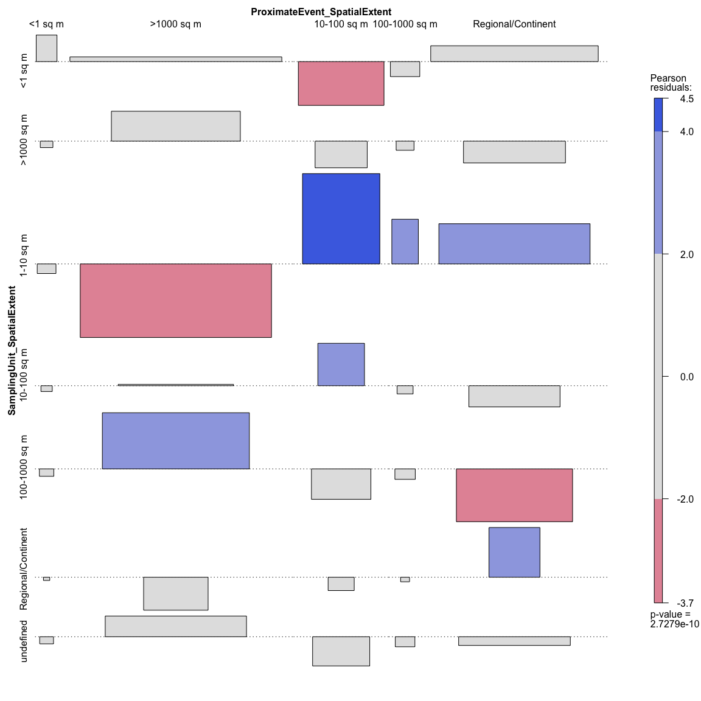

Untitled
================
Rachel Smith
11/12/2019

### Exploratory plots of space/time variables:

#### Contingency tables:

*Study Spatial Extent vs. Event Spatial Extent:*

Here, rows are Study Spatial Extent and columns are Event Spatial
extent.

    ##                       ProximateEvent_SpatialExtent
    ## Study_SpatialExtent    <1 sq m >1000 sq m 10-100 sq m 100-1000 sq m
    ##   <1 sq m                    0          1           0             0
    ##   >1000 sq m                 0         88           0             0
    ##   1-10 sq m                  1          3           0             0
    ##   10-100 sq m                0          5          17             2
    ##   100-1000 sq m              0          6           0             0
    ##   Regional/Continental       0          1           0             0
    ##   undefined                  0          0           0             0
    ##                       ProximateEvent_SpatialExtent
    ## Study_SpatialExtent    Regional/Continent
    ##   <1 sq m                               0
    ##   >1000 sq m                           25
    ##   1-10 sq m                             7
    ##   10-100 sq m                           0
    ##   100-1000 sq m                         1
    ##   Regional/Continental                 25
    ##   undefined                             7

*Sampling Unit Spatial Extent vs. Event Spatial Extent:*

Here, rows are Sampling Unit Spatial Extent and columns are Event
Spatial extent.

    ##                           ProximateEvent_SpatialExtent
    ## SamplingUnit_SpatialExtent <1 sq m >1000 sq m 10-100 sq m 100-1000 sq m
    ##         <1 sq m                  1         31           0             0
    ##         >1000 sq m               0         16           0             0
    ##         1-10 sq m                0          6          13             2
    ##         10-100 sq m              0          9           4             0
    ##         100-1000 sq m            0         25           0             0
    ##         Regional/Continent       0          0           0             0
    ##         undefined                0         17           0             0
    ##                           ProximateEvent_SpatialExtent
    ## SamplingUnit_SpatialExtent Regional/Continent
    ##         <1 sq m                            22
    ##         >1000 sq m                          4
    ##         1-10 sq m                          23
    ##         10-100 sq m                         3
    ##         100-1000 sq m                       1
    ##         Regional/Continent                  5
    ##         undefined                           7

*Sampling Duration Before vs. Event Duration:*

Here, rows are Sampling Duration Before and columns are Event Duration
extent.

    ##                         ProximateEvent_Duration
    ## Sampling_Duration_Before days hours months weeks years
    ##            days             3     6      0     0     0
    ##            months           5     0     26     9     0
    ##            none             1     0     28     3    20
    ##            single sample    0     0      1     3     0
    ##            weeks            0     0      1     0     0
    ##            years           15    10     39     4    23

*Sampling Duration During vs. Event Duration:*

Here, rows are Sampling Duration During and columns are Event Duration
extent.

    ##                         ProximateEvent_Duration
    ## Sampling_Duration_During days hours months weeks years
    ##            days             3    10      0     0     0
    ##            hours            1     0      6     0     0
    ##            months           1     0     52     8     7
    ##            none             7     0     28     3     1
    ##            single sample    0     6      4     3    16
    ##            weeks            0     0      1     2     0
    ##            years           12     0      4     3    19

*Sampling Duration After vs. Event Duration:*

Here, rows are Sampling Duration After and columns are Event Duration
extent.

    ##                        ProximateEvent_Duration
    ## Sampling_Duration_After days hours months weeks years
    ##           days             3     0      0     0     0
    ##           months           2     0     42     9     7
    ##           none            11     0     11     1    13
    ##           single sample    0     0      3     6     0
    ##           weeks            0     6      2     0     0
    ##           years            8    10     37     3    23

#### Mosaic plots:

*Study Spatial Extent vs. Event Spatial Extent:*

*Sampling Unit Spatial Extent vs. Event Spatial Extent:*
<!-- --><!-- -->

*Sampling Duration Before vs. Event Duration:*
<!-- --><!-- -->

*Sampling Duration During vs. Event
Duration:*

<!-- --><!-- -->

*Sampling Duration After vs. Event
Duration:*

<!-- --><!-- -->
